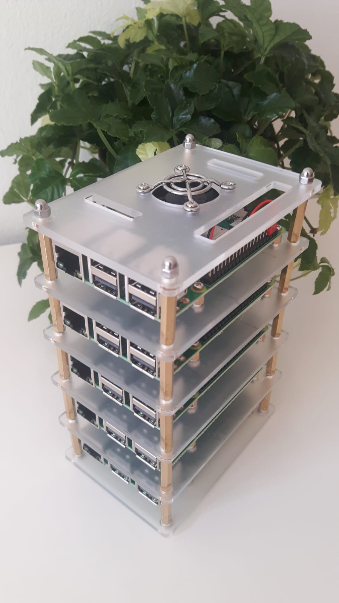

# Macondo: Yet Another Raspberry Pi Cluster

<p align="center">
 
</p>

There are some practical reasons motivating this exercise;
however, the main one is just for fun... Why not? 

<!-- <div style="float: right">

</div>
-->

## Hardware

* 5 (or any other number) Raspberry Pi 3 Model B+
* A 32 GB micro SD card for each Raspberry Pi (I used a SanDisk ultra class 10, manufacturer number: SDSQUAR-032G-GN6TA)
* An ethernet switch (I used this [8-port 100 Mbps Renkforce Network Switch ](https://www.conrad.com/p/renkforce-network-switch-8-ports-100-mbps-1483812))
* A USB power supply with enough wattage (I used this [ANKER 60W 10-Port](https://www.anker.com/products/A2133111))
* Micro-USB and ethernet cables
* A Raspberry Pi cluster case


## Setup

### Bootstrap and Configuration

The SD cards must be flashed (I used [raspbian](https://www.raspberrypi.org/documentation/installation/installing-images/linux.md)),
ssh enabled (just create an empty file called "ssh" in the boot partition: `touch /mount-point/boot/ssh`), and the cluster powered up (of course) before starting with the configuration. I used Ansible to configure the devices. By using Ansible, most of the configuration can be done simultaneously on all the devices.

* `nmap` or similar can be used to discover the devices IP addresses (my network IP address is 172.16.0.0/24).  The IP addresses can be listed in an Ansible [inventory.cfg](ansible/inventory.cfg).

    ```bash
    sudo nmap -sn 172.16.0.0-255 |grep rasp -i  -B 2
    ```
* The ansible playbooks are located in the ansible folder ( `cd ansible` ) and support the following tasks:

    * Creating a new user (e.g. `macondo`), deploying an ssh public key, and, finally, deleting the old user `pi`:
    
        ```bash
        ansible-playbook playbooks/create_user.yml -i inventory.cfg --user pi --ask-pass  -e user_name=macondo  -e ssh_key=FULL_PATH_TO_ID_RSA_PUB 
        
        ansible-playbook playbooks/remove_user.yml -i inventory.cfg --user macondo --ask-become-pass -e user_name=pi
        ```
    * [Optional] In addition, devices hostnames can be changed. This playbook has to be applied to each individual device, for instance:
        
        ```bash
        ansible-playbook playbooks/change_hostname.yml -i "172.16.0.178," --user macondo --ask-become-pass -e hostname=remedios 
        ```

    My cluster nodes are called: Ursula, Amaranta, Rebeca, Pilar and Remedios.

## Additional Ansible Scripts

### Shutdown and Reboot
```bash
ansible-playbook playbooks/shutdown.yml -i inventory.cfg --user macondo --ask-become-pass

ansible-playbook playbooks/reboot.yml -i inventory.cfg --user macondo --ask-become-pass
```

### Adhoc commands

For instance:
```bash
ansible all -m ping -i inventory.cfg -u macondo
```

## Credits
- https://github.com/garthvh/ansible-raspi-playbooks
- https://github.com/vicchi/ansible-pi-lockdown
- [Image source](https://www.cuisineaz.com/recettes/tartelettes-aux-framboises-a-la-creme-de-mascarpone-2922.aspx)
